# QUIET SPACE

## 📌 Project Overview

**Quiet Space** is a responsive multi-page website created to support emotional wellbeing through simple, accessible self-care content. It provides a calm and comforting space where users can slow down, reflect, and take small but meaningful steps toward better mental health. The site is designed with a gentle visual style, soft colours, and clear navigation to reduce overwhelm and create a sense of safety.

The website includes four main pages:

- **Home** – A welcoming introduction that encourages users to start their journey with calming messages and support.
- **Gentle Reminders** – A collection of short, uplifting messages to help users stay grounded and mindful throughout the day.
- **Daily Care** – Practical tips for simple self-care habits that promote balance and emotional resilience.
- **Safe Resources** – Curated links and suggestions for trusted tools, readings, and external support.

The **Need Support?** tab is included in the navigation but currently inactive, planned for future development as a space for professional resources. Quiet Space is intended for anyone experiencing stress, anxiety, or emotional fatigue — such as students, remote workers, or anyone going through a difficult time — and aims to offer a safe digital environment where users can feel supported and less alone.

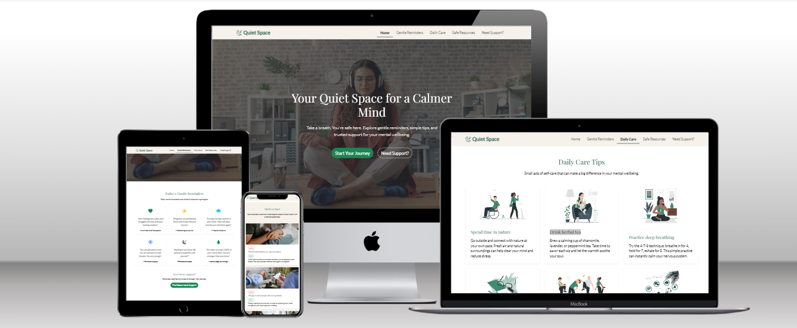

## 🚀 Features

### Existing Features

#### 🔗 Navigation Bar

The responsive navigation bar appears consistently on all four pages: Home, Gentle Reminders, Daily Care, and Safe Resources. It includes links to each section and a logo that returns to the homepage.  
This feature allows users to easily move between sections without confusion, reducing cognitive load and improving user experience — especially for those seeking a calm and intuitive interface.

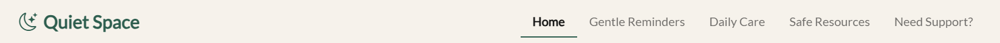

#### 🏠 Home Page

The homepage welcomes users with a short, supportive introduction and a calming visual layout.  
This section helps users feel safe and grounded from the first interaction, setting the tone for the rest of the site.

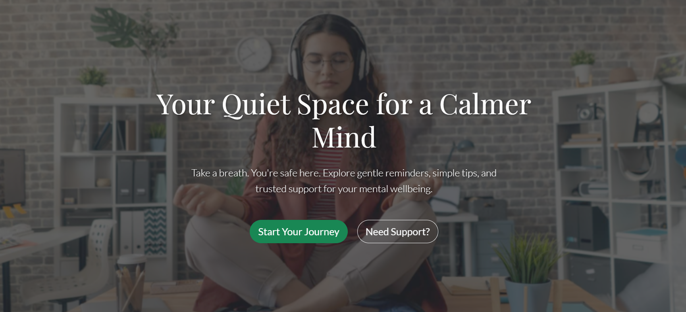

#### 🌿 Why Quiet Space?

The "Why Quiet Space?" section introduces users to the core purpose of the website. It visually presents four key areas of support:

- **Gentle Reminders** – Daily messages to soothe your mind and bring focus.
- **Daily Care Tips** – Simple ways to reconnect with your body and breath.
- **Grounding Tools** – Visuals, sounds, and breathing guides to help you stay present.
- **Safe Support** – Curated resources and trusted links for when you need more help.

This section helps the user instantly understand what they can expect from Quiet Space and encourages them to explore the parts that resonate most with their current emotional needs.

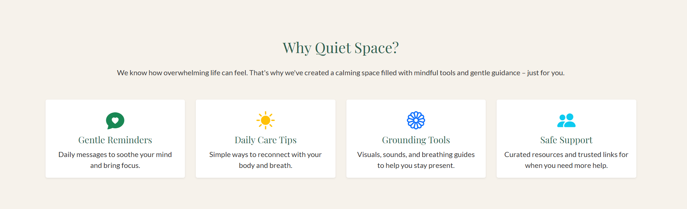
_The “Why Quiet Space?” section introduces the main features of the site in a clear and calming layout._

#### 💬 How Are You Feeling Today?

This interactive check-in section invites users to pause and reflect on how they’re currently feeling. It presents a range of emotional states – such as Happy, Calm, Excited, Anxious, Sad, or Overwhelmed – each with a supportive description.

The goal of this section is to normalise emotional ups and downs, help users build emotional awareness, and provide a moment of connection with themselves. It empowers users to name their feelings without judgement, which is a key part of improving mental wellbeing.

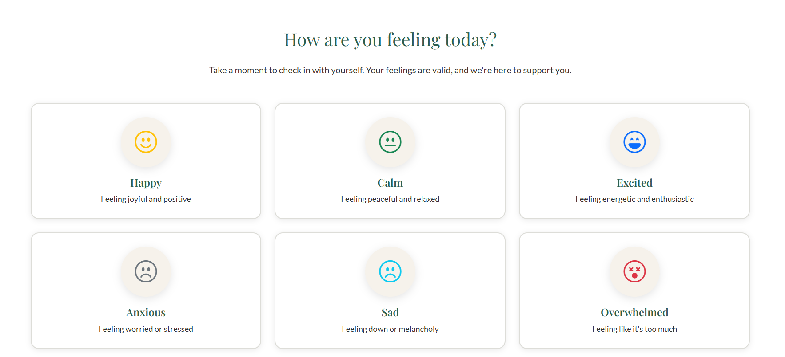  
_A visual tool that encourages users to acknowledge their current emotional state._

#### 🧠 Myth vs Fact

This educational section helps users distinguish between common misconceptions and the realities of mental health. It presents six popular myths – such as "Mental health problems are a sign of weakness" or "You should be able to snap out of depression" – and immediately follows them with evidence-based facts.

Each myth-fact pair is paired with an image and displayed in a clean, card-based layout that makes the content easy to scan and understand. This section encourages users to question assumptions, learn the truth, and become more mindful in how they think and talk about mental health.

It plays an important role in reducing stigma and promoting awareness, especially for users who may feel misunderstood or judged.

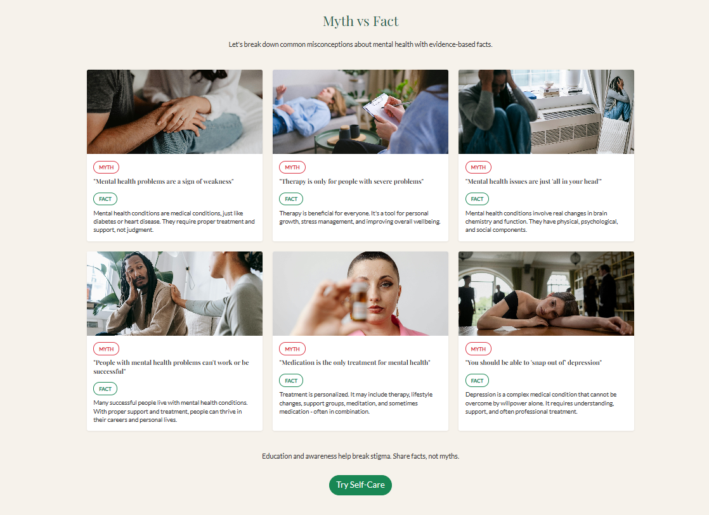

#### 🔻 The Footer

The footer section appears on every page and provides a consistent closing element to the site. It includes a brief description of the Quiet Space mission, a copyright notice, and a gentle reminder that help is always available.

On the right side, it displays social media icons (Facebook, Instagram, LinkedIn, Twitter).

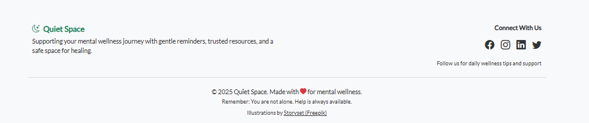  
_Footer section with brand message, social links, and mental wellness reminder._

#### 🌿 Gentle Reminders Page

A collection of short, uplifting phrases displayed in simple visual cards.  
Designed to support emotional regulation, this feature gives users quick moments of calm and reassurance throughout their day.

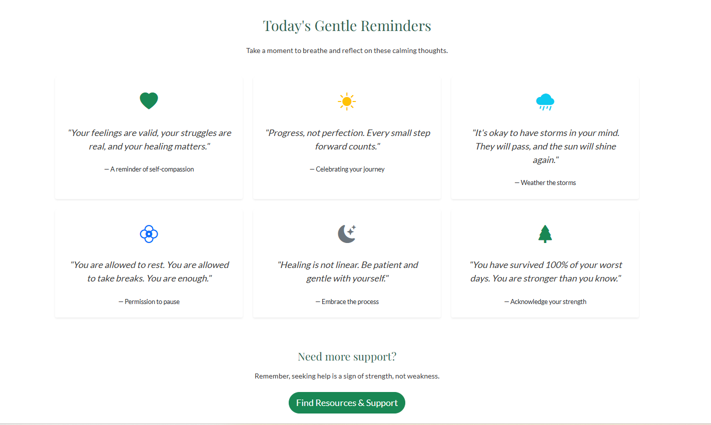  
_A calming selection of gentle reminders with supportive icons and encouraging messages._

#### ☕ Daily Care Page

Displays small, actionable self-care tips with illustrations — such as breathing exercises, journaling, or screen breaks.  
These tips are helpful for users who want to build healthy routines without pressure or overwhelm.

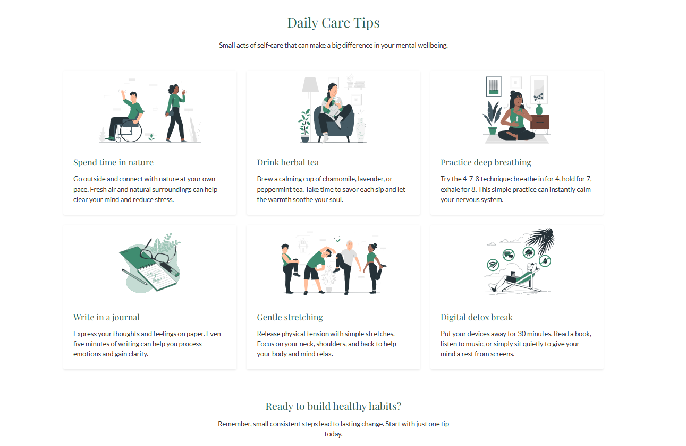  
_A selection of gentle daily actions to support mental wellbeing._

#### 🛡️ Safe Resources

This section provides a curated collection of reliable and supportive mental health resources. The content is organised into three collapsible categories:

- **Meditation & Mindfulness:**  
  Includes trusted apps like Headspace, Calm, Insight Timer, and MBSR (Mindfulness-Based Stress Reduction) to help users develop daily mindfulness and relaxation habits.

- **Mental Health Information:**  
  Offers users easy access to evidence-based articles and educational content to better understand mental health topics.

- **Crisis & Emotional Support:**  
  Guides users toward immediate help through crisis lines, support groups, and emotional assistance services.

The accordion layout makes the page clean and easy to navigate, letting users choose the type of help they need without feeling overwhelmed.

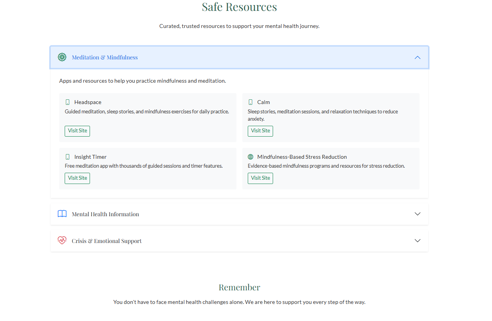  
_A calm, collapsible interface for users to find trustworthy mental health support._

#### ❌ Need Support? Tab (Planned)

Currently inactive, this tab is included for future development.  
It’s intended to guide users toward professional support options in times of emotional crisis.

---

### 🌟 Additional Features

- **Fully responsive layout** – Works smoothly on desktops, tablets, and smartphones.
- **Soothing visual style** – Gentle colours and rounded elements help reduce stress and promote calm.
- **Accessible structure** – Clear headings, semantic HTML, and logical reading order improve usability for all users, including those using screen readers.

## 🧪 Testing

Thorough testing was conducted throughout the development process to ensure the website functions smoothly, is visually consistent across devices, and supports the user’s mental wellness journey in an intuitive and accessible way.

### ✅ Features tested

Each page and feature of the site has been individually tested to ensure usability and expected behaviour:

- **Navigation Bar**: Works consistently across all four pages. All links function correctly and allow the user to navigate easily.
- **Hero Sections and Content Areas**: Display correctly and adapt well to different screen sizes.
- **Internal Anchor Links** (e.g. "Find Resources & Support" button): Scrolls smoothly to the relevant section.
- **Images**: Render correctly on all devices.
- **Interactive Elements**: Accordion panels on the "Safe Resources" page open and close as expected.

The project was tested on:

- 💻 Desktop (1920×1080)
- 📱 Mobile devices (Galaxy S9+, iPhone SE)
- 📱 Chrome Developer Tools (responsive view)

The layout adapts correctly on all screen sizes and resolutions. Font sizes, spacing and component placement remain consistent and readable.

### 📊 Lighthouse testing

Lighthouse tests were run on both mobile and desktop views. After optimisation, the following results were achieved:

- **Performance**: 100 (desktop)
- **Accessibility**: 85
- **Best Practices**: 81
- **SEO**: 100

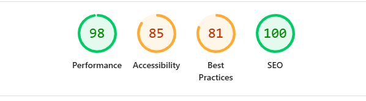

### ✅ HTML and CSS validation

All pages were tested using the official W3C Validators:

- ✅ HTML passed without errors  
  
- ✅ CSS passed without errors  
  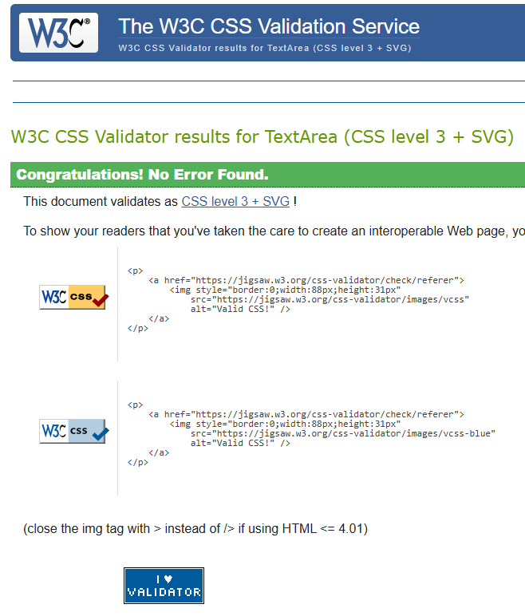

### 🐞 Bugs and issues encountered

#### 1. 🔻 Large image files caused poor LCP scores in Lighthouse

This affected loading time, especially on mobile.

- **Solution**: All images were resized and compressed using MozJPEG.

**After optimisation:**  
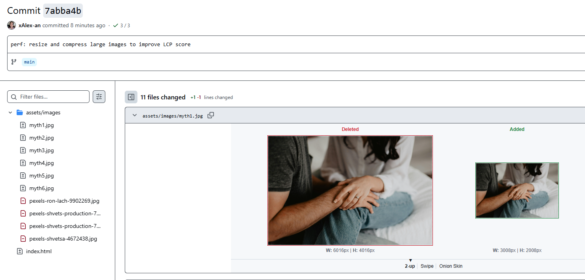

---

#### 2. 🔺 Navbar overlapping internal anchor links on small screens

When clicking internal links (e.g. "Find Resources & Support"), the fixed navigation bar overlapped the target section, cutting off the top of the content.

- **Solution**: Added a global CSS rule to offset scroll position for anchor targets:

  html {
  scroll-padding-top: 55px;
  }

#### 3. 🔸 Low contrast in hero subtitles

Lighthouse flagged low contrast ratios in some headings and subtitles.

- **Solution**: The text color was adjusted to meet WCAG AA accessibility standards.

**Before fix:**  
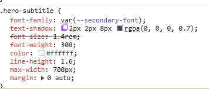

**After fix:**  
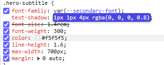

---

## 🎨 UX and Colour Accessibility

To ensure a **positive user experience (UX)**, special attention was given to choosing appropriate and accessible colour combinations throughout the website.

During testing, I used a contrast checker to evaluate the **readability and visual clarity** of text elements, particularly in the hero section. My goal was to meet **WCAG AA standards** for accessibility and provide a comfortable experience for users with different levels of vision.

### 🎯 Contrast Colour Example

- Text color: `#2E5E4F`
- Background color: `#F6F2EB`
- Contrast Ratio: **6.65**
- Verdict: _Good_ for large text, but _only fair_ for smaller text.

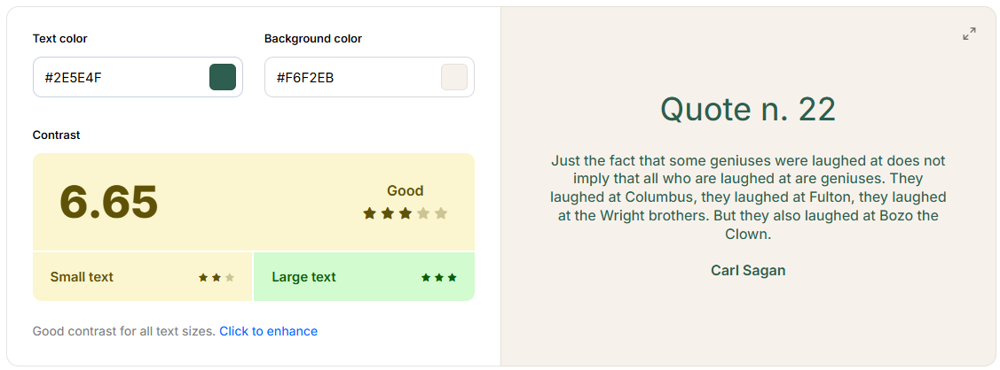

- Text color: `#4A4A4A`
- Background color: `#F6F2EB`
- Contrast Ratio: **7.94**
- Verdict: _Very Good_ – accessible for all text sizes.

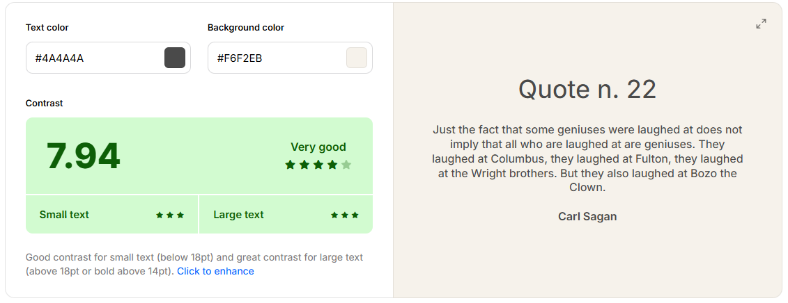

This ensures that headings and subtitles are clear and legible across various devices and lighting conditions, enhancing both **usability** and **accessibility**.

## 🚀 Deployment

This project was deployed using **GitHub Pages**.

To deploy the site, I followed these steps:

1. Pushed the final version of the project to the `main` branch of the GitHub repository.
2. Navigated to the repository's **Settings** tab.
3. Scrolled down to the **Pages** section in the left-hand menu.
4. Under **Source**, selected the `main` branch and set the root folder (`/`) as the source.
5. GitHub Pages automatically built and deployed the project.
6. After a few moments, a banner appeared at the top of the Pages section with the live site link.

✅ The live website is available here:  
[🔗 View Live Site](https://xalex-an.github.io/mental-health-awareness/)

## 🙏 Credits

### 📝 Content

- Several text sections and ideas were created with the support of **GitHub Copilot** and **ChatGPT**, which provided suggestions, content structure ideas, and writing assistance.
- I wanted to add a **modern touch** to the **"How Are You Feeling"** section, so I used **Copilot in VS Code** to generate creative ideas and code snippets for a more interactive and contemporary feel.
- Inspiration for layout and section ideas was drawn from award-winning designs on [Awwwards](https://www.awwwards.com/).
- I focused on **accessibility and good UX practices**, paying attention to high-contrast colours, visual clarity, and a calming user interface.
- All sections were styled using the **Bootstrap 5** framework for responsiveness and mobile-first design.

### 🎨 Media

- **Illustrations** used on the site were provided by  
  [Storyset by Freepik](https://storyset.com/) – open-source SVG illustrations.
- **Photos** used throughout the site (e.g., homepage background and cards) were downloaded from  
  [Pexels](https://www.pexels.com/) – royalty-free image platform.
- **Icons** were sourced from [Bootstrap Icons](https://icons.getbootstrap.com/).
- All **screenshots** and **mockups** were created using browser DevTools and Canva.

---

🎉 Huge thanks to all the creators and platforms listed above for their resources, tools, and inspiration that helped bring **Quiet Space** to life.
